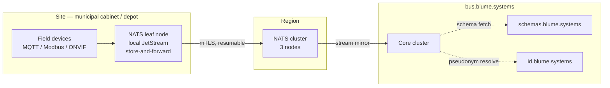

# Blume Event Bus

**Specification v1.1** · `blume-events`

The common event fabric shared by all Blume municipal systems. This document is
normative: a system is BEB-conformant if it satisfies every MUST in this
specification and passes the conformance suite in `conformance/`.

### Changes in v1.1

Substantive:

- `vision` carries no `subject_ref`, and uses a stream- and hour-scoped
  `track_ref` instead. §6.
- `traffic` and `telemetry` are anonymous domains. `transit-core` is the only
  subject-linked producer outside `identity-gateway`. §6, §13.
- Neither `audit` nor `analytical` may carry a pseudonym. A pseudonym is
  personal data. §7.
- `envelope`, `sealed` and `track_ref` join the common types. §5.
- Canonical JSON is RFC 8785, and enums are open with an explicit marker. §9.

Errata against v1.0:

- §4's example omitted `provenance`, which is now REQUIRED on every event, and
  located `observed_at` directly in `data` rather than in `provenance`.
- §5's `subject_ref` example used a domain that can no longer carry a pseudonym
  and a string that is not valid RFC 4648 base32.
- §11's catalog example named schema `2.1.0.json` under a type ending `.v1`. The
  schema major and the type major are the same number by construction; it should
  have read `1.2.0.json`.
- §13 described `signal-broker` as a subject-linked producer. It is not.

---

## 1. Scope

Five system families publish to and consume from the bus:

| Domain | Repository | Emits |
|---|---|---|
| `traffic` | `signal-broker` | Signal state, demand, incidents, plan changes |
| `telemetry` | `utility-telemetry` | Meter reads, substation load, pressure, outages |
| `transit` | `transit-core` | Vehicle positions, stop events, load estimates |
| `vision` | `mca-ingest` | Stream health, detections, classifications, retention |
| `identity` | `identity-gateway` | Pseudonym lifecycle, authentication, consent, erasure |

### Goals

- One envelope, one addressing scheme, one schema registry across all domains.
- Domain systems remain independently deployable and independently contracted.
- Cross-domain correlation of a natural person is **cryptographically prevented**
  by default, and possible only through an audited, purpose-bound resolution
  service.
- Site deployments survive WAN loss without data loss.

### Non-goals

- Request/response RPC. The bus carries facts, not commands. Command APIs are
  per-system and out of scope.
- A shared database. Systems own their state; the bus carries notifications of
  change.
- Sub-millisecond control loops. Signal timing safety loops stay local to the
  controller.

---

## 2. Transport

**NATS JetStream**, with a leaf-node-per-site topology.

Chosen over Kafka for operational weight (a site deployment is a single ~15 MB
binary, not a JVM and a coordination service) and over raw MQTT for the lack of
native persistence, replay, and subject-scoped authorisation. Field devices that
can only speak MQTT connect through the NATS MQTT gateway at the site node and
are mapped onto the subject taxonomy in §3.



Site nodes MUST retain locally for at least 72 hours so that a WAN outage is a
delivery delay rather than a data loss event. Reconnection replays from the last
acknowledged sequence.

---

## 3. Subject taxonomy

```
beb.<env>.<tenant>.<domain>.<event-name>.<major>
```

| Token | Rule |
|---|---|
| `env` | `prod` \| `stage` \| `dev` |
| `tenant` | Deployment identifier, lowercase, 2–12 chars. One per contract. |
| `domain` | One of the five in §1 |
| `event-name` | `kebab-case`, past tense, no domain prefix |
| `major` | `v1`, `v2` — major schema version only |

```
beb.prod.mcr.traffic.signal-phase-changed.v1
beb.prod.mcr.vision.object-classified.v1
beb.prod.mcr.identity.pseudonym-epoch-rotated.v1
```

Consumers subscribe with wildcards: `beb.prod.mcr.traffic.>` for a whole domain,
`beb.prod.*.telemetry.outage-declared.v1` for one event across tenants where the
consumer holds multi-tenant authorisation.

One JetStream stream per `<env>.<tenant>.<domain>` triple. Streams MUST NOT span
tenants — tenant isolation is enforced at the account boundary, not by filtering.

---

## 4. Envelope

CloudEvents 1.0, JSON mode, with four Blume extension attributes. Publishers MUST
NOT define additional extensions without registry approval.

```json
{
  "specversion": "1.0",
  "id": "01K4ZQ9F2X8H3N7VBM0T6Y5RJD",
  "source": "//blume.systems/mcr/traffic/controller/A41-0271",
  "type": "systems.blume.traffic.signal-phase-changed.v1",
  "subject": "asset:signal:A41-0271",
  "time": "2026-09-07T14:02:11.417Z",
  "datacontenttype": "application/json",
  "dataschema": "https://schemas.blume.systems/traffic/signal-phase-changed/1.4.0.json",
  "blumetenant": "mcr",
  "blumeretention": "operational",
  "blumetrace": "00-4bf92f3577b34da6a3ce929d0e0e4736-00f067aa0ba902b7-01",
  "blumeseq": 88213,
  "data": {
    "intersection_id": "A41-0271",
    "approach": "NB",
    "phase_from": "green",
    "phase_to": "amber",
    "dwell_ms": 42000,
    "plan_id": "peak-am-v7",
    "actuated": true,
    "provenance": {
      "producer": "signal-broker/1.0.0",
      "node": "site-mcr-north-02",
      "observed_at": "2026-09-07T14:02:11.912Z"
    }
  }
}
```

| Attribute | Requirement |
|---|---|
| `id` | ULID. Monotonic within a source. The idempotency key. |
| `source` | `//blume.systems/<tenant>/<domain>/<asset-class>/<asset-id>` |
| `type` | `systems.blume.<domain>.<event-name>.<major>` — reverse-DNS, mirrors §3 |
| `time` | RFC 3339, UTC, millisecond precision. Time the fact occurred, not the time it was published. |
| `dataschema` | Absolute registry URI including full semver |
| `blumetenant` | Duplicates the subject token so the envelope is self-describing off-bus |
| `blumeretention` | Retention class, §7 |
| `blumetrace` | W3C `traceparent` |
| `blumeseq` | Per-source monotonic counter. Gaps indicate loss. |

Where publication time differs materially from occurrence time (store-and-forward
after a site outage), publishers MUST set `data.provenance.observed_at` to the
observation time and leave `time` as the occurrence time. `provenance` is
REQUIRED on every event in every domain, so the field is always available and
there is no second location for it.

---

## 5. Common types

Defined once in `schemas/common/`, referenced by `$ref` from every domain schema.
Domain schemas MUST NOT redefine these shapes. Seven files: `envelope`, `geo`,
`asset_ref`, `subject_ref`, `provenance`, `sealed`, `track_ref`.

A domain schema MAY narrow a common type at its own reference site — restricting
`asset_ref.class` to `substation`, or adding `confidence` to the required set of
`provenance`. Under 2020-12 a sibling keyword applies to the same instance as
`$ref`, so this constrains without redefining.

Common value types are closed: `additionalProperties: false`, so a member
smuggled in beside a pseudonym fails validation rather than riding along. Event
data schemas are open, because closing them would make adding an optional field
break every consumer pinned to an older minor, and §9 promises the opposite.
`beb-lint` enforces both directions.

### `geo.json`

```json
{
  "lat": 53.6097,
  "lon": -2.1561,
  "accuracy_m": 4.5,
  "cell": "MCR-0742-19"
}
```

WGS84. `cell` is the municipal grid reference, coarse enough (≈250 m) to be
usable in analytical retention where exact coordinates are stripped.

### `asset_ref.json`

```json
{ "class": "signal", "id": "A41-0271", "tenant": "mcr" }
```

Asset classes are registered centrally: `signal`, `camera`, `meter`,
`substation`, `vehicle`, `stop`, `gateway`, `controller`.

### `subject_ref.json`

The only permitted way to reference a natural person. See §6.

```json
{ "pid": "sub:transit:e3:7F3QK2NDMXAWB4PY", "epoch": 3 }
```

Only `transit` and `identity` may carry one. `traffic` and `telemetry` are
anonymous domains and `vision` uses `track_ref`, so the domain token is
constrained to those two: a `sub:vision:` pseudonym fails at the schema layer as
well as in `beb-lint`. The `epoch` member MUST equal the epoch encoded in `pid`.
JSON Schema cannot express that equality, so the SDKs and `beb-lint` enforce it.

### `provenance.json`

```json
{
  "producer": "mca-ingest/2.11.3",
  "node": "site-mcr-north-02",
  "observed_at": "2026-09-07T14:02:11.912Z",
  "confidence": 0.94,
  "method": "onvif-analytics"
}
```

`provenance` is REQUIRED on every event in every domain.

`confidence` is REQUIRED on any event produced by inference rather than direct
measurement — every `vision` detection, every `transit` passenger estimate.
Consumers MUST NOT treat an inferred event as a measured one. The catalog's
`inferred` flag is the machine-readable form of this rule: `beb-lint` requires
that an event declaring `inferred: true` adds `confidence` to the required set of
`provenance` at its own reference site, and that one declaring `inferred: false`
does not.

### `sealed.json`

```json
{
  "alg": "AES-256-GCM",
  "key_id": "dk_01K4ZQ9F2X8H3N7VBM0T6Y5RJD",
  "epoch": 3,
  "ct": "<base64>",
  "iv": "<base64>"
}
```

A `data` field classified as subject-linked, encrypted at publish time under a
per-subject data key. A `$ref` to this type *is* the classification marker for a
field; there is no separate annotation to keep in sync.

`key_id` is opaque and carries no derivable relation to the subject. A sealed
blob travels wherever its event travels, so a pseudonym embedded in the key
handle would sit in cleartext beside the ciphertext it protects and defeat the
sealing. The gateway alone holds the mapping.

Additional authenticated data is the JCS serialisation of `{"blumetenant", "id",
"path", "type"}`, where `path` is the JSON Pointer of the sealed field within the
event. A blob lifted from one event and pasted into another fails authentication
rather than decrypting cleanly into the wrong context.

### `track_ref.json`

```json
{ "stream_id": "cam-mcr-0742-03", "track_id": "9f2c1a7be4d05836", "window": "2026-09-07T14Z" }
```

A visual track, scoped to exactly one stream and one wall-clock UTC hour. The
`vision` domain's substitute for a subject reference. `track_id` is a random
64-bit value which MUST NOT be reused, MUST NOT be shared between streams, and
MUST NOT cross the window boundary.

The window is wall-clock, not rolling. A person walking through 14:59:59 into
15:00:00 receives two unrelated tracks. That truncation is the bound, not a
defect: a rolling one-hour lifetime would track better and prove less, and any
analysis needing continuity across the seam is an analysis this system declines
to support.

Banned in `analytical` retention — an hour-scoped per-person handle in a 90-day
store reconstructs exactly what the scoping prevents. Permitted in `evidential`,
which `footage-sealed` requires.

### `envelope.json`

The §4 envelope as a schema, so that it is checkable rather than merely
described. Closed: publishers MUST NOT define additional extension attributes
without registry approval, so an unrecognised attribute is a validation failure.
The `data` member is validated separately against the schema named by
`dataschema`.

---

## 6. Subject pseudonymisation

**The root identifier for a natural person exists only inside
`identity-gateway`. No other system holds it, and no event on the bus carries
it.**

### Which domains carry pseudonyms

**A domain may carry `subject_ref` only where honouring the event requires
per-person state. Where an entitlement class suffices, the event MUST carry the
class and no subject reference.**

| Case | Per-person state? | Verdict |
|---|---|---|
| Boarding assistance | A registered needs profile must be looked up | Pseudonym |
| Fare cap, concessionary settlement | A sum over that person's journeys | Pseudonym |
| Accessible crossing request | Extend the green. Nothing to look up. | Class only |

Applied to the five domains:

| Domain | Carries | Why |
|---|---|---|
| `transit` | `subject_ref` | Fare caps and assistance profiles are per-person state |
| `identity` | `subject_ref` | It is the domain that issues them |
| `traffic` | nothing | A controller does not need to know who presented the fob to give them longer to cross |
| `telemetry` | nothing | Assets, not people |
| `vision` | `track_ref` | See below |

`transit-core` is therefore the only subject-linked producer outside
`identity-gateway`.

### Why `vision` carries no pseudonym

A pseudonym is only obtainable if the producer can ask the gateway *who is
this*, and it can only ask if it holds a persistent biometric template. That
template is `root_subject_id` under another name, accumulating in the one domain
this construction exists to keep it out of. The cryptography would then be
protecting the bus while the actual identifier sat on the node: a consumer
holding every stream still could not join `vision` to `transit`, and
`mca-ingest` would hold a face database of everyone who walked past a camera.

`vision` uses `track_ref` (§5) instead: one stream, one wall-clock hour, no
persistence beyond it.

Two consequences, chosen rather than overlooked:

- **Cross-camera journey times are not possible from `vision` alone.** Corridor
  travel time comes from `traffic` detectors and `transit` vehicle positions,
  which measure it directly under an ordinary basis.
- **`vision` cannot participate in `/v1/correlate` at all.** A court order
  reaches the evidential footage store under a legal basis — see
  `vision.footage-sealed` — not the bus and not the resolution endpoint.

Anyone arriving here wanting cross-camera analytics is reading a refusal, not an
oversight. The distinction to hold on to is `transit.assistance-requested`, which
does keep a pseudonym because staff must retrieve a profile to honour it. That is
what per-person state looks like; a longer green phase is not.

### Derivation

Every domain that carries pseudonyms receives a distinct pairwise one:

```
pid(domain, epoch, subject) =
    "sub:" ‖ domain ‖ ":e" ‖ epoch ‖ ":" ‖
    base32(HMAC-SHA256(K_domain_epoch, root_subject_id)[0..10])
    -- ten bytes, RFC 4648 base32, sixteen characters, no padding

K_domain_epoch = HKDF(K_tenant_root, info = domain ‖ epoch)
```

`K_tenant_root` is held in the tenant's KMS and is never exported. Domain keys
are derived at the gateway and never leave it.

The consequence is the important part: the pseudonym a person carries in
`traffic` and the pseudonym they carry in `vision` are unlinkable without
`K_tenant_root`. A consumer holding a full copy of every stream on the bus cannot
join them. This is a property of the construction, not a policy.

### Epoch rotation

`epoch` increments every 90 days per tenant. Pseudonyms from different epochs are
unlinkable by the same argument, which caps the window over which any single
domain can build a longitudinal profile. Rotation is announced on
`identity.pseudonym-epoch-rotated.v1`; systems MUST NOT attempt to bridge epochs
locally.

### Resolution

Cross-domain correlation is possible, deliberately, through one endpoint:

```
POST https://id.blume.systems/v1/correlate
```

It requires a purpose code, an expiry, two distinct authorised principals, and a
legal basis reference. It emits `identity.correlation-performed.v1` to the
`audit` retention class before returning a result. There is no configuration in
which it is silent, and there is no bulk mode.

### Erasure

Event logs are append-only, which makes deletion by rewrite impractical. BEB uses
crypto-shredding instead.

Any `data` field classified as subject-linked is encrypted at publish time with a
per-subject data key wrapped by `K_tenant_root` — a `$ref` to `sealed.json` is
that classification. On `identity.erasure-requested.v1`, the gateway destroys the
data key and emits `identity.erasure-completed.v1`. Ciphertext remains in the log
and is permanently unrecoverable. Systems MUST handle undecryptable payloads as a
normal condition, not an error.

Decoding a sealed field yields exactly three outcomes, and an SDK MUST
distinguish all three:

| Outcome | Meaning | Consumer |
|---|---|---|
| `Opened` | Key fetched, authentication passed | Proceed |
| `Shredded` | The gateway confirmed key destruction | Terminal. Drop the record. |
| `Unavailable` | Key could not be fetched, or the caller is not authorised | Transient. `nak` and retry. |

Collapsing `Shredded` into `Unavailable` makes an authorisation failure look like
an erasure, which is the shape of bug that silently deletes data.

### Where erasure records live

`audit` carries no personal data, pseudonyms included (§7), but proof that an
erasure was performed must outlive the record naming whom it was performed on.
The two requirements are met by splitting the pair, and the same split applies to
correlation:

| Event | Class | Carries |
|---|---|---|
| `correlation-performed` | `audit` | `correlation_id`, both domains, purpose code, both principals, legal basis, expiry. No pids. |
| `correlation-detail-recorded` | `evidential` | `correlation_id`, both pids, read logged |
| `erasure-requested` | `evidential` | `erasure_id`, `subject_ref` |
| `erasure-completed` | `evidential` | `erasure_id`, `subject_ref`, key destruction attestation |
| `erasure-attested` | `audit` | `erasure_id`, outcome, timestamp, principal. No subject reference. |

`evidential` retention is per tenant policy, so an erasure record can itself
expire. The `erasure_id` is the join between the two, and it resolves to a person
only for as long as the evidential record survives — which is the correct decay.

---

## 7. Retention classes

`blumeretention` selects the stream policy. Publishers MUST set it correctly;
CI rejects a schema whose examples use a class inconsistent with its field
classifications.

| Class | Duration | Contents |
|---|---|---|
| `operational` | 7 days | Live system state. May contain `subject_ref`. |
| `analytical` | 90 days | Aggregates and coarsened geo. `subject_ref` stripped, not pseudonymised further. |
| `evidential` | Per tenant policy | Encrypted, legal-hold capable, access logged per read. |
| `audit` | 7 years | Append-only, no personal data **including pseudonyms**, no erasure path. |

An event MUST carry exactly one class. Where a producer needs both an operational
and an analytical view, it emits two events, and the analytical one carries no
`subject_ref`.

A pseudonym is personal data: pseudonymisation is not anonymisation. `beb-lint`
MUST therefore fail any schema in the `audit` or `analytical` class that
transitively `$ref`s `subject_ref.json`, and any `analytical` schema that
transitively `$ref`s `track_ref.json`.

Two further structural rules follow from the same reasoning, both enforced by
`beb-lint` rather than by review:

- An `analytical` schema in `telemetry` MUST NOT admit an `asset_ref` of class
  `meter`. A 30-minute domestic read keyed by meter identifier is personal data
  whether or not it carries a pseudonym, so analytical aggregates key on `cell`.
- An `analytical` schema MUST reference `geo.json#/$defs/coarse` rather than the
  root or `#/$defs/precise`, so that exact coordinates are unrepresentable rather
  than merely stripped by convention.

---

## 8. Delivery semantics

- **At-least-once.** Consumers MUST be idempotent on `id`.
- **Ordering** is guaranteed per `source`, not globally. Consumers requiring
  order MUST partition by `source` and MUST NOT assume cross-source ordering.
- **Deduplication** — publishers set `Nats-Msg-Id` to `id`; the stream dedup
  window is 2 minutes.
- **Backpressure** — pull consumers only. Push consumers are prohibited; a slow
  consumer must not become a producer's problem.
- **Poison messages** — after 5 delivery attempts a message moves to
  `beb.<env>.<tenant>.dlq.<domain>` with the failure reason in headers. The DLQ
  is monitored, not ignored.

---

## 9. Schema registry and evolution

JSON Schema 2020-12, served from `schemas.blume.systems`, source of truth in
`blume-events/schemas/`. The registry is a static artifact built from the repo —
there is no runtime schema service to fail.

Within a major version, changes MUST be backward compatible:

- Adding an optional field is allowed.
- Adding an enum value is allowed **only** if consumers are specified to ignore
  unknown values. Every BEB enum carries that clause.
- Removing a field, narrowing a type, making an optional field required, or
  changing units is a **major** version and a new subject.

Schema semantic version major MUST equal the `major` token in `type` and in the
subject. §9's identity of "a major version" and "a new subject" holds only if
they are the same number, and `beb-lint` enforces the equality.

Every published version stays on disk under `schemas/<domain>/<event>/<semver>.json`
permanently. The registry is a static artifact built from the repo, so a
`dataschema` URI that resolved once resolves forever, and `beb-lint` has the
previous version to diff against without reaching into git history.

### Open enums

An additive enum change is compatible only because consumers ignore unknown
values — which is a promise about consumers, not a property of the schema. A
consumer validating a `1.1.0` event against a pinned `1.0.0` schema would reject
the new value and the promise would be worthless.

So every `enum` in a BEB schema carries the marker `"x-beb-enum": "open"` and the
clause *Consumers MUST ignore unknown values* in its description. `beb-lint`
requires the marker on every enum. `beb-gen` emits an `Unknown` variant for every
open enum in both languages, and consumer-side validation in the SDKs relaxes the
`enum` constraint on them. The strict form is retained for producers, so a
misspelled value still fails a contract test.

### Canonical JSON

RFC 8785 (JCS): object keys sorted by UTF-16 code unit, no insignificant
whitespace, ECMAScript number serialisation. Both SDKs MUST agree byte for byte.

- `NaN`, `Infinity` and `-0` are rejected at validation, not at serialisation.
- An integer outside ±2^53 MUST be carried as a string. `blumeseq` is within
  range and stays a number.
- `confidence` is a double in [0,1]. It is not rounded to fixed precision: a
  lossy round-trip is worse than a long decimal.

`tools/beb-lint` enforces this in CI by diffing against the previous published
schema. A non-compatible change on the same major fails the build.

Both major versions run in parallel during migration. The publisher dual-writes;
the old subject is removed only once consumer lag on it reaches zero and stays
there for 14 days.

---

## 10. Security

- **Transport** — mTLS everywhere. Site nodes hold per-node certificates issued
  by the tenant CA, 90-day lifetime, automated renewal.
- **Authorisation** — NATS accounts per `<env>.<tenant>`. Within an account, each
  service holds a JWT with explicit publish and subscribe subject permissions.
  `signal-broker` can publish `beb.prod.mcr.traffic.>` and nothing else. A
  compromised traffic controller cannot forge a vision detection.
- **Cross-tenant** — no account trusts another. Multi-tenant consumers hold
  separate credentials per tenant and join outside the bus.
- **Key custody** — `K_tenant_root` lives in the tenant's KMS. Blume operates the
  software; the council holds the key. Erasure and correlation are therefore
  capabilities the tenant can revoke unilaterally.

---

## 11. Repository layout

```
blume-events/
├── catalog.yaml              # every registered event, one entry each
├── schemas/
│   ├── common/               # envelope, geo, asset_ref, subject_ref,
│   │                         #   provenance, sealed, track_ref
│   ├── traffic/
│   ├── telemetry/
│   ├── transit/
│   ├── vision/
│   └── identity/
├── gen/
│   ├── go/                   # generated, committed, never hand-edited
│   └── rust/
├── conformance/
│   ├── golden/               # canonical events every SDK must round-trip
│   └── invalid/              # events every SDK must reject, with reasons
├── tools/
│   ├── beb-lint/             # schema compatibility gate
│   ├── beb-gen/              # codegen
│   └── beb-replay/           # replay a window into a local consumer
└── docs/
```

`catalog.yaml` is the human-readable index and the input to codegen. `beb-lint`
checks that every entry resolves to a schema on disk, that the majors agree, that
`subject_linked` matches the schema's transitive `$ref` graph rather than the
author's intent, that `retention` is consistent with that graph, and that
`inferred` matches whether `confidence` is required at the event's own
`provenance` reference site:

```yaml
- type: systems.blume.vision.object-classified.v1
  domain: vision
  schema: vision/object-classified/1.2.0.json
  retention: operational
  subject_linked: false
  inferred: true
  description: >
    A tracked object in a registered stream was assigned a class by
    on-node analytics. Inferred; carries confidence.
  producers: [mca-ingest]
```

### SDK surface

Go and Rust are first-class and generated from the same schemas. Rust:

```rust
use blume_events::{Bus, vision::ObjectClassified};

let bus = Bus::connect("nats://bus.blume.systems:4222")
    .tenant("mcr")
    .credentials(creds)
    .await?;

let mut sub = bus
    .subscribe::<ObjectClassified>("analytics-worker")
    .durable()
    .await?;

while let Some(msg) = sub.next().await {
    let ev = msg.event();
    if ev.data.confidence < 0.85 {
        msg.ack().await?;      // inferred and weak — drop, don't escalate
        continue;
    }
    handle(&ev).await?;
    msg.ack().await?;
}
```

The SDK MUST reject at compile time any attempt to place a raw identifier in a
`subject_ref` — the type is constructible only from a gateway-issued pseudonym.
Making the wrong thing impossible beats documenting that it is forbidden.

Concretely, `SubjectRef` has exactly two constructors: deserialisation of a value
matching the `sub:<domain>:e<n>:<base32>` grammar, and a test-only constructor
behind a build tag in Go and a feature flag in Rust. There is no
`SubjectRef::new(String)`. Note that the CloudEvents `subject` attribute is an
unrelated thing — it names an asset — and is never typed as a `SubjectRef`.

---

## 12. Testing

- **Conformance** — every SDK runs `conformance/golden/` end to end and MUST
  round-trip byte-identically after canonical JSON ordering. Every file in
  `conformance/invalid/` MUST be rejected with the stated error class.
- **Contract tests** — each producing repo pins a `blume-events` version and
  tests its emitted events against the schema in CI. A producer cannot merge an
  event that does not validate.
- **Compatibility** — `beb-lint` diffs every schema against the last published
  version on every PR.
- **Soak** — a site node is partitioned from the WAN for 4 hours under synthetic
  load; the test asserts zero loss and correct ordering on reconnect.
- **Privacy** — a test asserts that no golden event in any domain contains a
  field matching known root-identifier patterns, and that two pseudonyms for the
  same synthetic subject in different domains have no computable relation without
  the tenant key.

---

## 13. Implementation order

1. `blume-events` — common schemas, envelope, `beb-lint`, Go and Rust SDKs,
   conformance suite. Nothing else starts until the envelope is frozen.
2. `identity-gateway` — pseudonym derivation, epoch rotation, erasure. It is the
   dependency for every subject-linked event elsewhere.
3. `utility-telemetry` — highest event volume, no subject linkage. Proves the
   transport under load without privacy surface.
4. `transit-core` — the first and only subject-linked producer outside
   `identity-gateway`. `signal-broker` — anonymous throughout.
5. `mca-ingest` — last. Highest sensitivity, and it benefits from every lesson
   the other four produce.

---

<sub>Blume Event Bus specification · `blume-events` · Questions to the platform
team.</sub>
